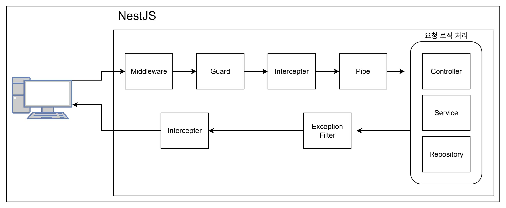
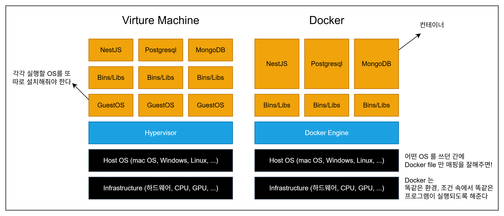

# study-nestjs

nestjs 학습하기

## 섹션1. 세팅하기

- nvm 설치 & ...

  ```
  #$ node -v => v22.16.0
  #$ npm -v => 10.9.2

  $ corepack enable
  # 확인: yarn -v => 1.22.22

  $ npm i -g @nestjs/cli
  # 확인: nest -v => 11.0.7
  ```

- yarn add -> npm install --save로 변경하면 됩니다.

## 섹션2. nest js 맛보기

- 프로젝트 시작하기

  ```bash
  # 새 폴더로 생성 시
  $ nest new {proj_name}

  # 현재 폴더에서 생성 시
  $ nest new .
  ```

- 실행하기
  ```
  $ yarn start:dev
  ```

## 섹션5. Nestjs 요청 라이프사이클



---

- 모듈 생성하기
  ```bash
  $ nest g resource
  #✔ What name would you like to use for this resource (plural, e.g., "users")? posts
  #✔ What transport layer do you use? REST API
  #✔ Would you like to generate CRUD entry points? No
  ```

## 섹션 6.

[Built-in HTTP exceptions](https://docs.nestjs.com/exception-filters#built-in-http-exceptions)

```
BadRequestException
UnauthorizedException
NotFoundException
ForbiddenException
NotAcceptableException
RequestTimeoutException
ConflictException
GoneException
HttpVersionNotSupportedException
PayloadTooLargeException
UnsupportedMediaTypeException
UnprocessableEntityException
InternalServerErrorException
NotImplementedException
ImATeapotException
MethodNotAllowedException
BadGatewayException
ServiceUnavailableException
GatewayTimeoutException
PreconditionFailedException
```

## 섹션 8. 의존성 주입, 제어의 역전

**의존성 주입(Dependency Injection)** <br/>
`객체 내에서 다른 객체를 직접 생성하는 전통적인 방식과 달리, 생성자 등을 통해 외부에서 필요한 객체를 받아오는 디자인 패턴` <br/>
class A, B 가 있고 A 에서 B 를 사용하려할 때 <br/>
A 블록 내에서 생성하지 않고 어딘가 외부에서 생성한 B 인스턴스를 <br/>
construtor(instance: B) 처럼 넣어주도록 정의하는 것 = 주입

```js
class A {
  constructor(instance: B)
}
```

- A 는 B 에 의존성을 갖고 있다.
- B 의 인스턴스는 A가 생성될 때 주입된다

**제어의 역전(Inversion of Control)** <br/>
`NestJS에서 프레임워크가 객체의 생성, 관리, 주입 등의 '제어'를 대신 수행하는 방식`
주입할 instance 의 생성/폐기에 개발자가 전혀 신경쓸 필요없이 기능에만 집중할 수 있게 <br/>
NestJS IoC Container 에서 알아서 생성/폐기 주입해준다

**프로바이더(Provider)** <br/>
`NestJS에서 @Injectable() 데코레이터가 붙어있어 IoC 컨테이너에 의해 관리되고 다른 컴포넌트에 의존성으로 주입될 수 있는 클래스들` <br/>
생성한 클래스를 '프로바이더'로 사용하려면?

1. {name}.service.ts 에서 class 위에 @Injectable() 을 입력해야 한다
2. {name}.module.ts 에서 providers: [] 안에 class 명을 입력해야 한다.

**모듈(Module)** <br/>
`NestJS 애플리케이션의 구조를 조직화하고, 컨트롤러와 프로바이더를 등록하여 IoC 컨테이너가 인식하도록 만드는 단위`

app.module.ts 에서 imports 는 다른 모듈을 불러올 때 사용

main.ts 에서 서버가 시작되고
AppModule 을 통해 확장해나가는구나~

---

## 섹션 9.

### Docker vs Virtual Machine



| 항목              | VM (Virtual Machine)                   | Docker (Container)                         |
| ----------------- | -------------------------------------- | ------------------------------------------ |
| **정의**          | 하드웨어 수준의 OS 전체 가상화         | 애플리케이션 수준의 환경 가상화            |
| **구조**          | Hypervisor 위에 Guest OS를 각각 구동   | Docker Engine 위에 컨테이너 구동           |
| **부팅 속도**     | 느림 (수 분)                           | 빠름 (수 초 이내)                          |
| **리소스 사용량** | 높음 (OS 포함)                         | 낮음 (커널 공유)                           |
| **격리 수준**     | 매우 높음 (각각의 완전한 OS)           | 상대적으로 낮음 (커널 공유)                |
| **보안성**        | 높음                                   | 설정에 따라 달라짐 (기본은 낮음)           |
| **이식성**        | 낮음 (OS마다 다름)                     | 높음 (이미지 기반으로 어디서나 실행 가능)  |
| **운영체제**      | 서로 다른 OS 가능 (Linux + Windows 등) | 커널 공유로 OS 제약 있음 (주로 Linux 기반) |
| **활용 목적**     | 전체 시스템 가상화, 다양한 OS 테스트   | CI/CD, Microservice, DevOps, 빠른 배포 등  |
| **대표 기술**     | VMware, VirtualBox, KVM                | Docker, Podman                             |

### docker compose vs k8s(쿠버네티스)

nestJS, mongoDB, nginx, redis 등등 관리해야할 도커 컨테이너가 너무 많아지니까
여러 도커 컨테이너를 관리할 툴이 나왔다.<br/>
=> kubernetes(전세계 70-80%, 배포환경에 적합), docker compose(로컬 개발환경에 적합), docker swarm 등

| 항목             | Docker Compose                               | Kubernetes (K8s)                                          |
| ---------------- | -------------------------------------------- | --------------------------------------------------------- |
| **정의**         | 여러 Docker 컨테이너를 한 파일로 구성해 실행 | 컨테이너들을 클러스터로 자동 배포·운영·오케스트레이션     |
| **구성 방식**    | `docker-compose.yml`                         | 다수의 YAML 리소스 파일 (`Deployment`, `Service` 등)      |
| **설정 간결성**  | 간단하고 직관적 (로컬 개발에 적합)           | 복잡하지만 유연하고 확장 가능 (프로덕션 환경 적합)        |
| **스케일링**     | `docker-compose up --scale`로 수동 설정      | 자동 스케일링 지원 (HPA, VPA 등)                          |
| **배포 전략**    | 없음 (전체 재시작)                           | 롤링 업데이트, Canary 배포 등 전략적 배포 가능            |
| **서비스 발견**  | 컨테이너 이름으로 기본 DNS 지원              | Cluster IP, DNS, LoadBalancer 등 완전한 서비스 디스커버리 |
| **자가 복구**    | 불가능 (장애 시 수동 재시작 필요)            | 자동 재시작, 복제, 상태관리                               |
| **로드밸런싱**   | 기본 미지원 (nginx 등 별도 설정 필요)        | 내부/외부 로드밸런싱 내장                                 |
| **보안 및 인증** | 비교적 단순 (기본은 없음)                    | RBAC, Secret, TLS 인증 등 강력한 보안 체계                |
| **주요 사용처**  | 로컬 개발, 단일 호스트 테스트                | 대규모 마이크로서비스, 클라우드 기반 운영 환경            |

### 도커 실행

1. 익스텐션 docker 설치하기(docker hub 와 연동하여 자동완성)
   - [docker hub] (https://hub.docker.com/_/postgres)
2. docker-compose.yaml 을 최상위경로에 생성

   ```yaml
   services: # 여러 컨테이너 서비스들을 정의하는 영역
     postgres: # postgres라는 이름의 서비스 정의 (컨테이너 이름처럼 작동)
       image: postgres:15 # Docker Hub에서 'postgres:15' 이미지를 pull해서 사용(15는 버전)
       restart: always # 컨테이너가 꺼졌을 때 자동 재시작 (시스템 재부팅 포함)
       volumes: # 로컬 디렉토리와 컨테이너 내부 경로를 연결 (데이터 보존 목적)
         # 컨테이너가 삭제되거나 업데이트되면 내부 데이터가 사라질 수 있어요. 볼륨은 컨테이너 외부에 데이터를 연결해 영구적으로 보존합니다.
         - ./postgres-data:/var/lib/postgresql/data
       ports: # 호스트와 컨테이너의 포트를 연결 (포트 포워딩)
         - '5432:5432'
       environment: # 환경 변수 설정 (컨테이너 내 Postgres 설정)
         POSTGRES_USER: postgres # Postgres 접속 사용자 이름
         POSTGRES_PASSWORD: postgres # Postgres 사용자 비밀번호
         POSTGRES_DB: postgres # 초기 생성할 데이터베이스 이름
   ```

3. 도커 이미지 실행

   ```cmd
   $ docker-compose up
   ...
   postgres-1  | 2025-07-01 08:33:04.742 UTC [1] LOG:  database system is ready to accept connections
   ```

4. 익스텐션 설치: Chris Kolkman 의 PostgreSQL
   - 데이터의 직관적 확인을 위해
5. Ctrl + Shift + P<br/>
   => "postgresql: add connection" 검색<br/>
   => 127.0.0.1 Enter<br/>
   => User: postgres<br/>
   => Password: postgres<br/>
   => Port: 5432<br/>
   => Standard Connection 선택<br/>
   => postgres 선택<br/>
   => name: {연결 이름}<br/>
   => 왼쪽 코끼리 그림 클릭하면 DB 정보 볼 수 있다.<br/>

### 앞으로 개발 작업 절차

1. docker 프로그램 실행
2. 컨테이너 이미지 실행: `$ docker-compose up`
3. nestjs 실행: `$ yarn start:dev`

## 섹션 10. TypeORM

1. 설치
   ```cmd
   $ yarn add @nestjs/typeorm typeorm pg
   ```
